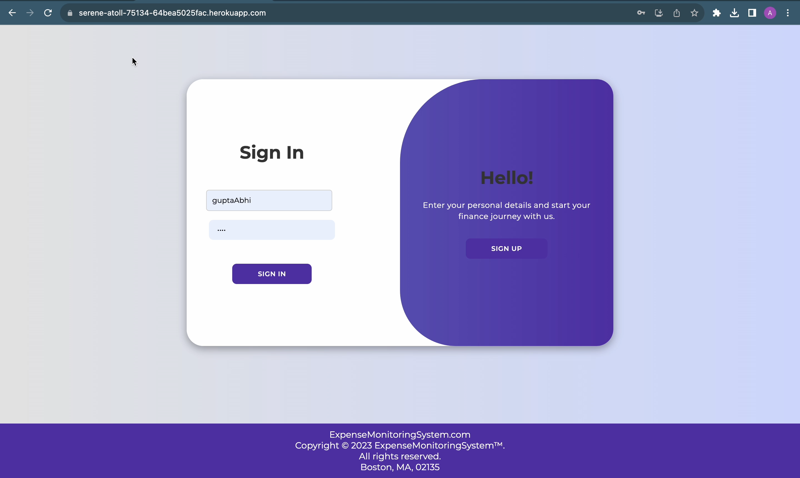
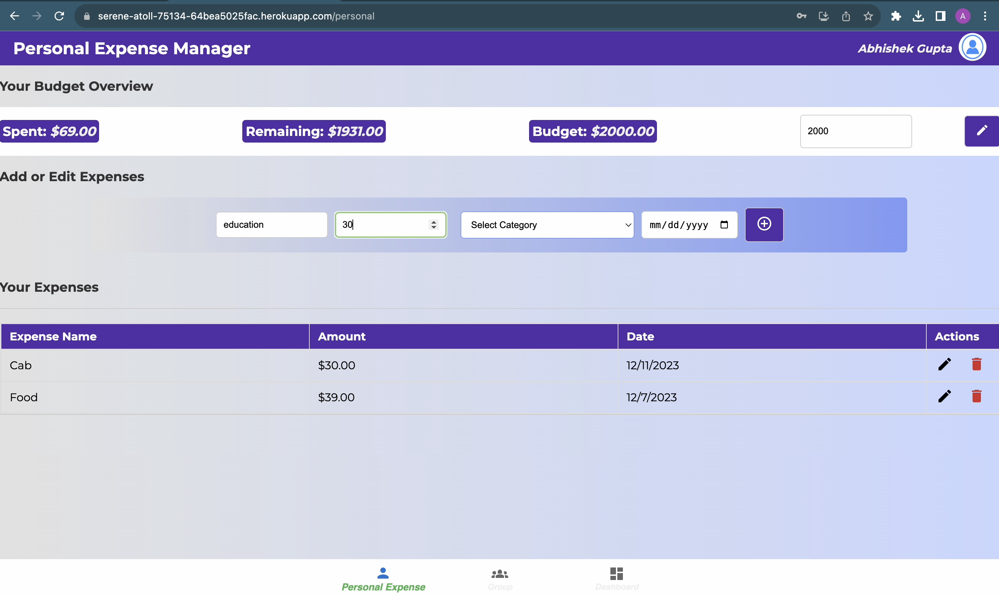
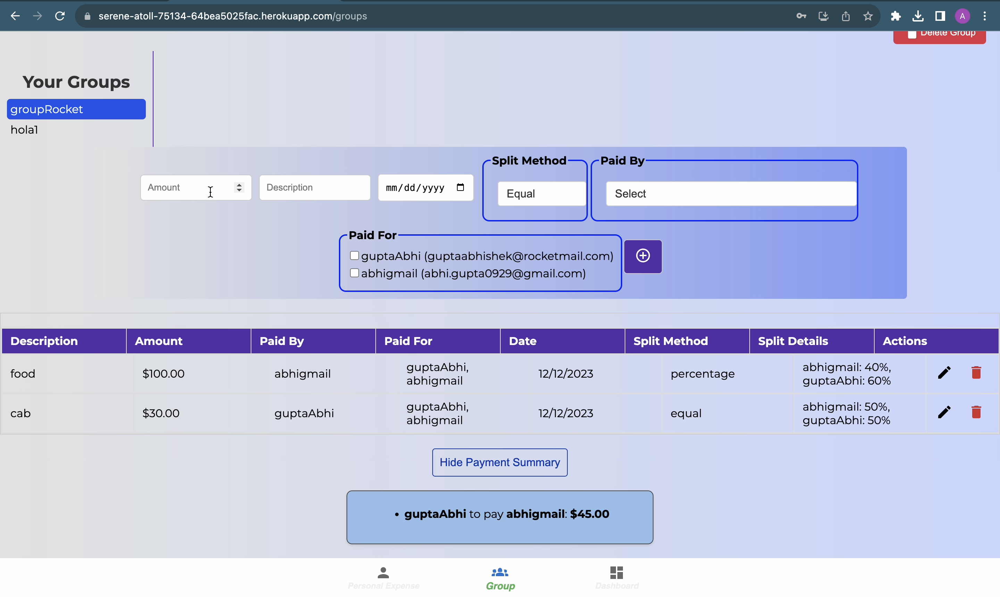
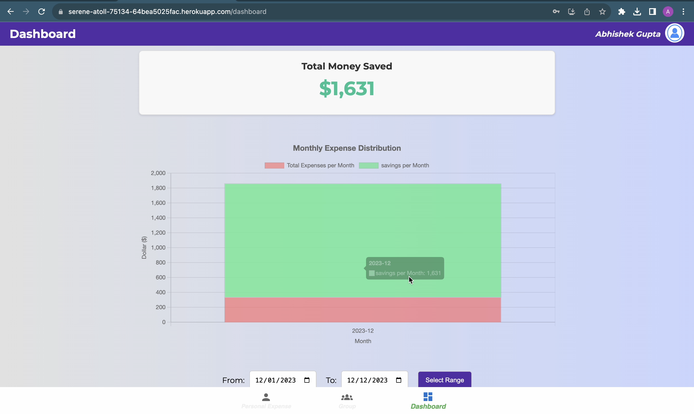
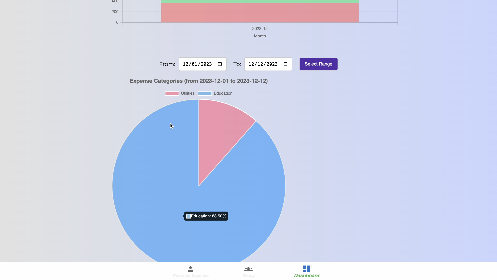

# Expense-monitoring-System

The Expense Monitoring System is designed as a comprehensive and interactive platform that assists users in monitoring, tracking, categorizing, and analyzing their expenses. It includes a feature for setting monthly budget limits, enabling users to effectively manage their finances. This system is particularly useful for users to study and track their spending patterns, offering insights into their monthly or yearly expenditure.

A key feature of this system is the 'Group Expense Manager', which allows users to create groups for managing shared expenses. This function supports various split methods, facilitating users to add expenses to a group and settle them efficiently. It also provides a payment summary detailing how expenses are divided and settled among group members.

The system's dashboard analytics offer a detailed overview of personal spending, presented through time series and categorized by spending types. This feature is instrumental in helping users develop healthy spending habits, ultimately contributing to their financial security and well-being.

### To run this project follow the guidelines mention below:

- `Frontend` : The frontend is `react` based application. Go to the frontend folder and check the README file in it and follow the instructions.
- `Backend` : The backend is a `flask` restful webservices. Follow the instruction in the readme file there to make the server up and running.

### Documentation

The `artifact` folder contains all the software specific documents:

1. `design` : Design related documents.
2. `project_configuration` : Project configuration documents.
3. `project_documents` : This folder includes every documents compiled together in a single folder.
4. `requirements` : The project requirements document is present here.
5. `status` : Project status documents are for each iteration.
6. `team_info` : documents related to team information.

### Deployment

#### Processs:

1. Add Procfile in root directory: `web: gunicorn --chdir backend/myapp app:app`
2. Add requirements.txt in the root directory.
3. Got to front end and execute `npm run build`.
4. Ensure that build in not in .gitignore
5. Initialize git from root folder: `git init`
6. Create a heroku app: `heroku create`
7. Add the changes in git heroku and commit.
8. Push the changes to to heroku main: `git push heroku abhi/deployment-test:main`
9. Open heroku app: `heroku open`
10. Debug options:
    1. logs details: `heroku logs --tail -a serene-atoll-75134`
    2. process info: `heroku ps -a serene-atoll-75134`
    3. heroku bash access: `heroku run bash`

#### app.py modification:

`pip install gunicorn`

`app = Flask(__name__, static_folder='/app/frontend/build', static_url_path='')`

Add serve api to deploy in heroku:

```python
@app.route('/', defaults={'path': ''})
@app.route('/<path:path>')
def serve(path):
    if path != "" and os.path.exists(app.static_folder + '/' + path):
        return send_from_directory(app.static_folder, path)
    else:
        return send_from_directory(app.static_folder, 'index.html')
```

Both frontend and backend are deployed on `Heroku` Salesforce server.

- Deployment link: https://serene-atoll-75134-64bea5025fac.herokuapp.com/

### Architecture


### Database ERD


### Deployment Design


### Demo Link:

https://drive.google.com/file/d/1BrFuUwa-lmmqPEa9iqWq17jiQw4uMVGa/view?usp=sharing

### Screenshots:












